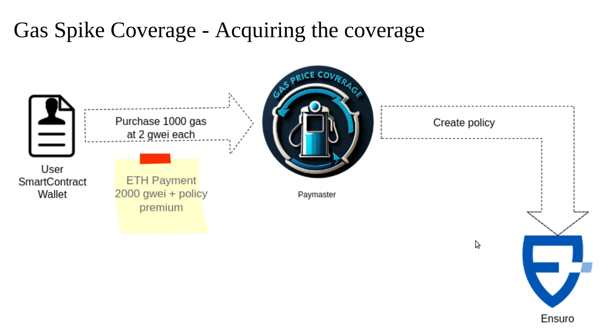
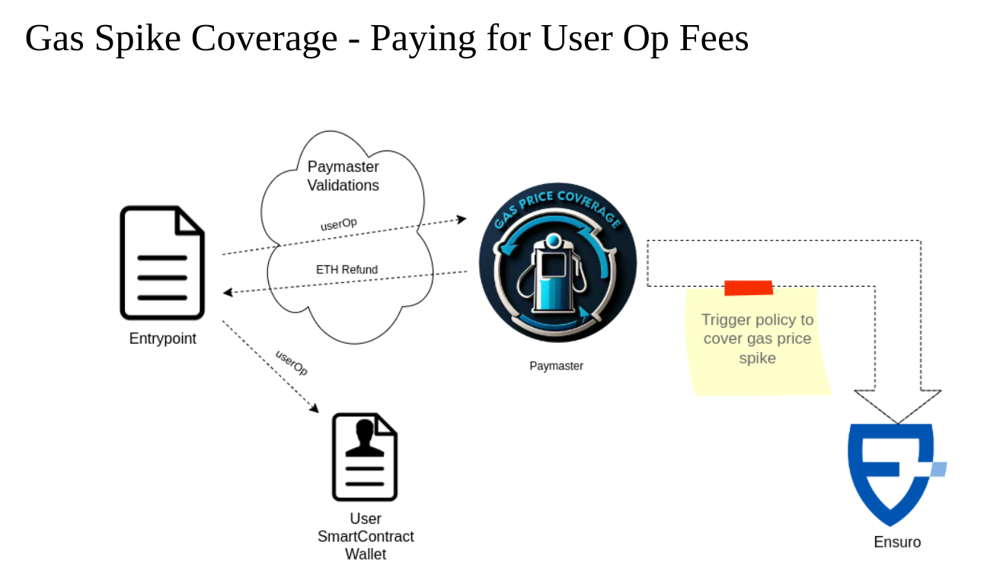
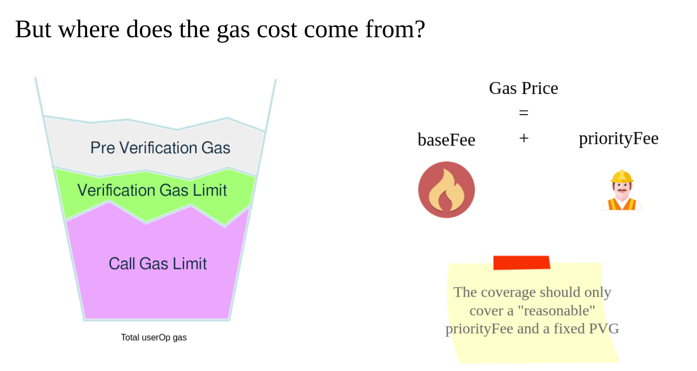
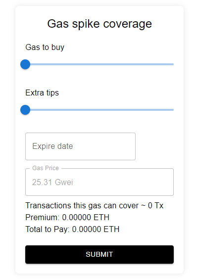

# Gas Spike Coverage

This project built for the Aleph Hackathon 2024 intents to build a Gas Spike Coverage for account abstraction users.

The user will be able to pre-pay a given number of gas units at a given price (in ETH) and if that pre-paid amount is not enough, a payout will be released to cover the extra cost.

For this coverage it will pay a premium and this will create a policy in the Ensuro protocol.

The pre-paid gas will be disbursed to the user in the form of sponsored transactions by a Paymaster contract of the ERC-4337 standard.

## How it works - Initial setup



## How it works - Coverage triggered

If the pre-paid gas wasn't able to pay for the gas is because the gasPrice was higher than expected. Then, the Ensuro policy is triggered and acquires ETH and funds the paymaster so it can keep covering the gas for the user.



## Coverage limits

To avoid the user over-spending gas by paying unreasonable prices, the coverage is limited to a "reasonable price" that's calculated as the block.basefee + X% of priority fee acceptable.
Whatever exceeds that price, is covered from a different bucket, the "extraForTips" one, and is won't be considered for the gas spike coverage.



## Front-end



## Status of the project

The Paymaster smart contract is developed, but it's missing to implement the withdrawal logic when the coverage expires and the user can withdraw the unused gas.
Also, Ensuro will withdraw the unused gas if the policy was triggered but not all the paid out gas was used.

Also many tests and security audits, for sure!

Regarding the front-end we just did the mockup of the front-end in React, but it's not connected with the smart contracts.

Besides that, a proper quantitative model to price the gas coverage needs to be built, analyzing the historical trends of the baseFee and other components of the risk (like the ETH vs USD volatility) to correctly price the coverage.

## Hardhat usage

Try running some of the following tasks:

```shell
npx hardhat help
npx hardhat test
REPORT_GAS=true npx hardhat test
npx hardhat node
npx hardhat ignition deploy ./ignition/modules/Lock.js
```
